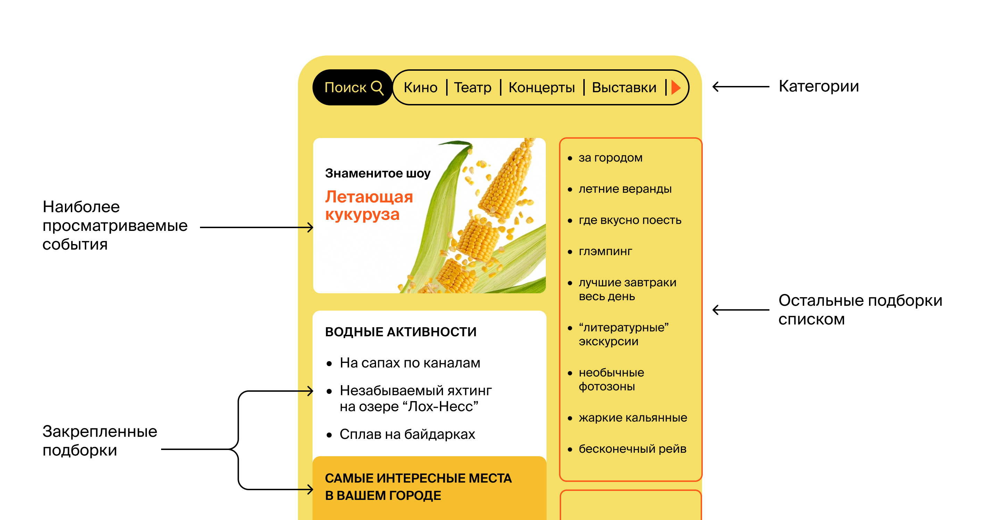

---

# *Java-explore-with-me*

Дипломная работа по курсу JAVA-developer от [Яндекс-Практикума](https://practicum.yandex.ru/java-developer/).

[Pull-Request](https://github.com/valikaev1989/java-explore-with-me/pull/1)

Описание проекта
-
Приложение представляет собой афишу, где можно предложить какое-либо событие от выставки до похода в кино и
набрать компанию для участия в нём.

Использованные технологии:
-

- Java Coretto 11,Maven, Spring-Boot, Hibernate, Postgresql, Lombok, Docker-compose 3.8, Jpa, JDBC, H2Database,
  RestTemplate

Функционал приложения:
-

- ### Эскиз страницы Front-end приложения:

1.  ### Проект реализован по микро-сервисной архитектуре:
    * ewm-service - реализация бизнес-логики
    * ewm-statistic - сбор и возвращение статистики по публичным эндпоинтам

2.  ### У сервисной части приложения 3 слоя управления:

* #### Публичный:
    * Запросы на получение категорий событий
    * Запросы на получение всех категорий событий
    * Запросы на получение подборок событий
    * Запросы на получение конкретной подборки событий
    * Запросы на получение конкретного события по id события в сокращенном информационном виде
    * Запросы на получение списка событий по заданным параметрам
* #### Приватный:
    * Запросы на создание события
    * Запросы на получение своих событий
    * Запросы на изменение события
    * Запросы на отмену события во время ожидания подтверждения администратором
    * Запросы на создание заявки на участие в событие
    * Запросы на получение своих заявок на участие в событиях
    * Запросы на получение заявок на участие в событии владельцем события
    * Запросы на отмену заявки на участие в событии пользователем
    * Запросы на отклонении и подтверждение заявок на участие в событии владельцем события
* #### Административный:
    * Запросы на создание\изменение\удаление категорий
    * Запросы на создание\удаление пользователей
    * Запросы на получение информации о пользователях
    * Запросы на создание\изменение\удаление\закрепление на главной странице подборок событий
    * Запросы на подтверждение\отклонение\изменение событий пользователей
    * Запросы на получение событий по заданным параметрам
    * Запросы на получение статистики по количеству публичных запросов

3. ### У статистической части приложения задача сбора информации по публичным запросам пользователей

4. ### Для обоих сервисов разработана подробная спецификация API.

   Ознакомится со спецификацией можно через онлайн-приложение [Swagger](https://editor-next.swagger.io).  
   [Основной сервис](https://github.com/valikaev1989/java-explore-with-me/blob/develop/swaggerSpecification/ewm-main-service-spec.json)  
   [Сервис Статистики](https://github.com/valikaev1989/java-explore-with-me/blob/develop/swaggerSpecification/ewm-stats-service.json)  
   Для работы со спецификациями вам понадобится редактор Swagger. Чтобы просмотреть спецификацию в редакторе,
   необходимо
   выполнить ряд шагов:

    * Скопировать ссылку на файл спецификации.
      Открыть онлайн-версию редактора Swagger.
    * На верхней панели выбрать меню File, затем пункт Import URL.
    * Вставить скопированную ссылку в текстовое поле появившегося диалогового окна и нажать OK.
5. ### Схема базы данных приложения:

6. Аутентификация и авторизация  
   Оба сервиса ExploreWithMe работают за VPN. С внешним миром их связывает GateWay.  
   Он контактирует с системой аутентификации и авторизации, а затем перенаправляет запрос в сервисы.  
   То есть, если гейтвей пропустил запрос к закрытой или административной части API, значит этот запрос успешно прошел
   аутентификацию и авторизацию.

Инструкция по запуску:
-

1. Чтобы запустить сервисы по отдельности (через main) нужна запущенная бд Postgres. С помощью pgAdmin4 создайте базу
   данных:
    1) Необходимо создать базу данных postgreSQL EWM_server:
        * POSTGRES_USER = root
        * POSTGRES_PASSWORD = root
        * POSTGRES_DB = EWM_server
    2) Необходимо создать базу данных postgreSQL EWM_statistics:
        * POSTGRES_USER = root
        * POSTGRES_PASSWORD = root
        * POSTGRES_DB = EWM_statistics
    3) Запустить сервис EWM-server
        * server.port = 8080
    4) Запустить сервис EWM-statistics
        * server.port = 9090
3. Для запуска проекта потребуется docker и docker-compose.
4. Команда "docker-compose up" запускает оба сервиса с их бд
5. Для проверки работоспособности приложения предусмотрены тесты для приложения постман:  
   [ewm-service](https://github.com/valikaev1989/java-explore-with-me/blob/develop/postmanTests/ewm-main-service.json)  
   [ewm-statistic](https://github.com/valikaev1989/java-explore-with-me/blob/develop/postmanTests/ewm-stat-service.json)